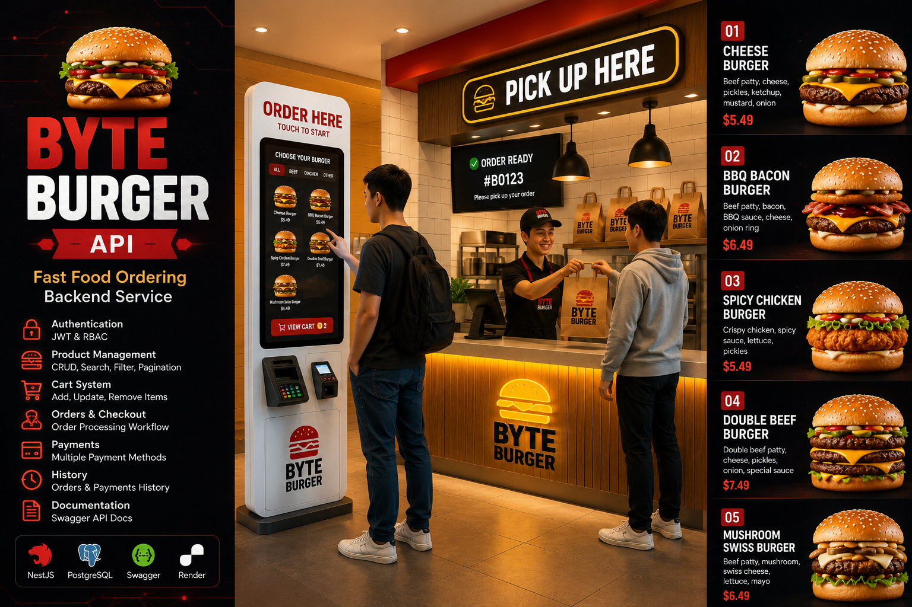

# 🍔 Byte Burger API

<p align="center">
  
</p>

<p align="center">
  <strong>Fast Food Ordering Backend Service</strong>
</p>

<p align="center">
  A modern REST API for managing products, carts, orders, payments, and customer transactions in a fast-food ordering ecosystem.
</p>

---

## 📖 Overview

Byte Burger API powers a futuristic fast-food ordering platform where customers can browse products, add items to their cart, place orders, complete payments, and view transaction history.

The project focuses on real-world backend development concepts including authentication, authorization, CRUD operations, search, filtering, pagination, checkout workflows, payment processing, and API documentation.

---

## ✨ Features

### 🔐 Authentication & Authorization

- JWT Authentication
- Protected Routes
- Role-Based Access Control (RBAC)
- Admin & Customer Roles

### 🍔 Product Management

- Create Product
- View Product
- Update Product
- Delete Product
- Product Categories

### 🔍 Search & Filtering

- Search Products
- Category Filtering
- Sorting
- Pagination

### 🛒 Cart System

- Add Items to Cart
- Update Quantity
- Remove Items
- Clear Cart

### 📦 Order Management

- Checkout Workflow
- Order Tracking
- Order History
- Order Status Updates

### 💳 Payment Processing

- Payment Simulation
- Multiple Payment Methods
- Payment History

### 📚 API Documentation

- Swagger Integration
- Interactive API Testing

---

## 🏗️ Architecture

```text
Product
   ↓
Cart
   ↓
Checkout
   ↓
Order
   ↓
Payment
   ↓
History
```

---

## 👥 Roles

### ADMIN

- Manage Categories
- Manage Products
- View Orders
- Update Order Status

### CUSTOMER

- Browse Products
- Manage Cart
- Place Orders
- Make Payments
- View History

---

## 🗄️ Database Schema

```text
users
roles

categories
products

cart_items

orders
order_items

payments

audit_logs
```

---

## 📡 Main Endpoints

### Authentication

```http
POST /auth/register
POST /auth/login

GET  /auth/me
```

### Categories

```http
GET    /categories
GET    /categories/:id

POST   /categories
PATCH  /categories/:id
DELETE /categories/:id
```

### Products

```http
GET    /products
GET    /products/:id

POST   /products
PATCH  /products/:id
DELETE /products/:id
```

### Cart

```http
GET    /cart

POST   /cart/items

PATCH  /cart/items/:id

DELETE /cart/items/:id

DELETE /cart/clear
```

### Orders

```http
POST   /checkout

GET    /orders
GET    /orders/:id

PATCH  /orders/:id/status
```

### Payments

```http
POST   /payments

GET    /payments
GET    /payments/:id
```

### History

```http
GET /orders/history

GET /payments/history
```

---

## 🔎 Query Features

### Search

```http
GET /products?search=burger
```

### Pagination

```http
GET /products?page=1&limit=10
```

### Filter

```http
GET /products?category=burger
```

### Sort

```http
GET /products?sort=price
```

---

## 🛠️ Tech Stack

- NestJS
- PostgreSQL
- Supabase
- JWT
- Swagger
- Render

---

## 🚀 Deployment

### API

```text
https://byte-burger-api.onrender.com
```

### Swagger

```text
https://byte-burger-api.onrender.com/api-docs
```

---

## 🎯 Learning Objectives

This project is designed to practice:

- REST API Development
- Authentication & Authorization
- Database Relationships
- CRUD Operations
- Search & Pagination
- Business Workflow Implementation
- Order & Payment Processing
- API Documentation
- Cloud Deployment

---

<p align="center">
  Built as part of the Backend API Ecosystem Collection 🍔
</p>
