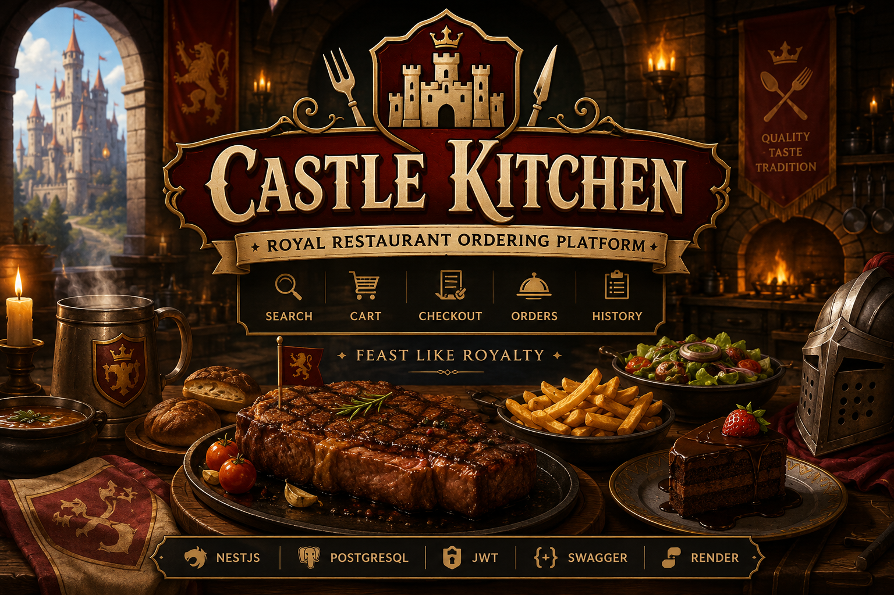

# 🥩 Castle Kitchen API

  

  <strong>Restaurant Ordering Backend Service</strong>

---

## 📖 Overview

Castle Kitchen is a restaurant ordering backend service designed as a real-world study case for learning modern backend development.

The application simulates a steakhouse restaurant where customers can browse menu items, add products to their cart, place orders, complete checkout, and track their order history.

This project is part of the **Backend API Ecosystem**, a collection of domain-driven backend applications built using a shared architecture.

---

## 🍽️ Domain Features

### Customer Features

- User Registration & Login
- Browse Menu
- Search Menu Items
- Filter by Category
- Add Items to Cart
- Checkout Orders
- Payment Processing
- Order History
- Review Menu Items

### Admin Features

- Manage Categories
- Manage Products
- Manage Orders
- Update Order Status
- View Customer Orders
- Dashboard & Statistics

---

## 🥩 Sample Menu

### Steaks

- Sirloin Steak
- Rib Eye Steak
- Tenderloin Steak
- T-Bone Steak

### Sides

- French Fries
- Mashed Potato
- Grilled Vegetables

### Drinks

- Cola
- Lemon Tea
- Mineral Water

### Desserts

- Chocolate Lava Cake
- Cheesecake
- Ice Cream

---

## 🔐 Authentication & Authorization

Roles:

- ADMIN
- CUSTOMER

Authentication:

- JWT Access Token
- Protected Routes
- Role Guards

---

## 📦 Core Modules

- Authentication
- Users
- Categories
- Products
- Cart
- Orders
- Payments
- Reviews
- Dashboard
- Audit Logs

---

## 🔍 Advanced Features

- Search
- Pagination
- Filtering
- Sorting
- Grouping
- History Tracking

---

## 🏗️ Technology Stack

- NestJS
- PostgreSQL
- Supabase
- JWT
- Swagger
- Render

---

## 🎯 Purpose

Castle Kitchen was built as a backend learning project focused on API design, authentication, authorization, relational databases, ordering workflows, and scalable application architecture.
