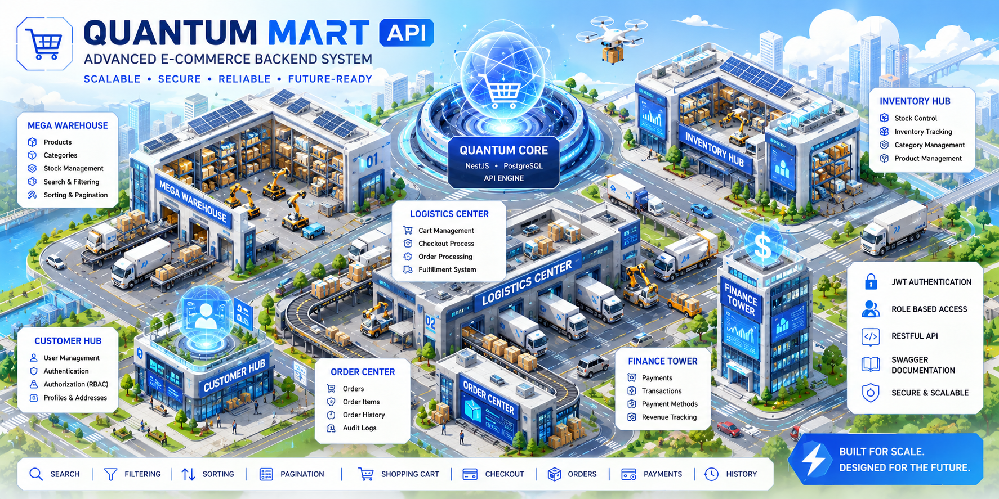

# 🛒 Quantum Mart API

<p align="center">
  
</p>

<p align="center">
  <strong>Advanced E-Commerce Backend System</strong>
</p>

<p align="center">
  A futuristic commerce platform focused on authentication, product management,
  cart workflows, checkout processing, order tracking, and payment simulation.
</p>

---

## 📖 Storyline

Quantum Mart is a next-generation e-commerce platform designed to handle modern digital commerce workflows.

As the backend engineer, your mission is to build a scalable REST API that powers product management, customer shopping experiences, order processing, and payment operations.

The system must support role-based access control, advanced product discovery, shopping carts, checkout flows, transaction history, and audit tracking.

---

## 🚀 Features

### 🔐 Authentication & Authorization

- JWT Authentication
- Role-Based Access Control (RBAC)
- Admin & Customer Roles
- Protected Routes

### 📦 Product Management

- Create Product
- Read Product
- Update Product
- Delete Product
- Product Detail Endpoint

### 🔎 Product Discovery

- Search Products
- Filter by Category
- Filter by Price Range
- Sort by Price
- Sort by Latest
- Pagination

### 🛒 Shopping Cart

- Add to Cart
- Update Quantity
- Remove Item
- Clear Cart

### 📋 Checkout System

- Create Order
- Generate Order Summary
- Clear Cart After Checkout

### 📦 Order Management

- Customer Order History
- Order Detail
- Order Status Tracking

### 💳 Payment Simulation

- Create Payment
- Payment Status
- Transaction History

### 📜 Audit Logs

- Login Activity
- Product Changes
- Order Activity
- Payment Activity

---

## 🧾 Database Tables

```text
users
roles

products

cart_items

orders
order_items

payments

audit_logs
```

---

## 🔑 Roles

### Admin

- Manage Products
- View Orders
- Update Order Status
- View Audit Logs

### Customer

- Browse Products
- Add To Cart
- Checkout Orders
- View Order History

---

## 🌐 Main Endpoints

### Auth

```http
POST /auth/register
POST /auth/login
GET  /auth/me
```

### Products

```http
GET    /products
GET    /products/:id

POST   /products
PATCH  /products/:id
DELETE /products/:id
```

### Cart

```http
GET    /cart

POST   /cart/items

PATCH  /cart/items/:id

DELETE /cart/items/:id

DELETE /cart/clear
```

### Checkout

```http
POST /checkout
```

### Orders

```http
GET /orders
GET /orders/:id

GET /orders/history

PATCH /orders/:id/status
```

### Payments

```http
POST /payments

GET /payments
GET /payments/:id
```

### Audit Logs

```http
GET /audit-logs
```

---

## 🏗️ Technology Stack

- NestJS
- PostgreSQL
- Sequelize ORM
- JWT Authentication
- Swagger
- Render
- Supabase

---

## 📚 API Documentation

Swagger documentation available at:

```http
/api-docs
```

---

## 🎯 Learning Objectives

This project is designed to practice:

- REST API Design
- Authentication & Authorization
- Database Relationships
- Product CRUD Operations
- Search & Pagination
- Cart & Checkout Logic
- Order Processing
- Payment Simulation
- Audit Logging
- API Documentation

---

<p align="center">
  Built as part of the Backend API Ecosystem study case collection.
</p>
