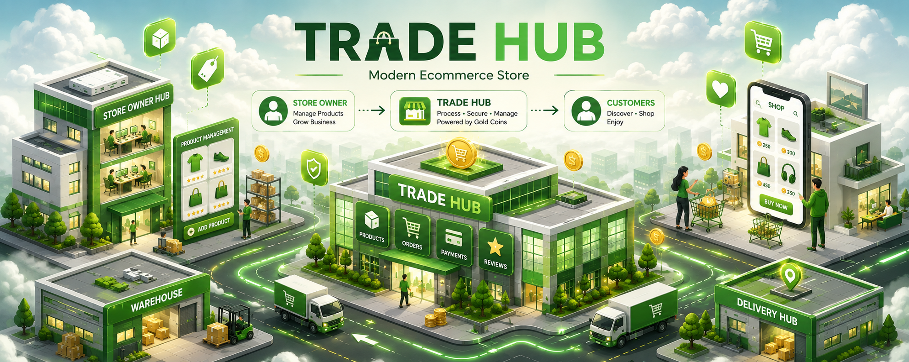

# 🏪 Trade Hub

<p align="center">
  
</p>

<p align="center">
  <strong>Modern Ecommerce Store Backend API</strong>
</p>

<p align="center">
  A backend study case focused on building a modern ecommerce platform with product management, shopping cart, checkout, payment processing, and order tracking.
</p>

---

## 📖 Overview

Trade Hub is a backend API project designed to simulate a real-world ecommerce store experience.

Unlike a marketplace, Trade Hub operates as a single-store ecommerce platform where customers can browse products, manage their shopping cart, place orders, complete payments, and track purchase history.

This project serves as a practical study case for learning backend architecture, API design, authentication, authorization, database relationships, and ecommerce workflows.

---

## ✨ Features

### 🔐 Authentication & Authorization

- User Registration
- User Login
- JWT Authentication
- Role-Based Access Control (RBAC)

### 📦 Product Management

- Create Product
- Update Product
- Delete Product
- Product Categories
- Product Search
- Product Filtering
- Product Pagination

### 🛒 Shopping Experience

- Shopping Cart
- Add To Cart
- Update Cart Items
- Remove Cart Items
- Checkout Process

### 💳 Order & Payment

- Order Creation
- Payment Processing
- Order Tracking
- Order History
- Payment History

### 📊 Administration

- Product Management
- Category Management
- User Management
- Dashboard Statistics
- Audit Logs

---

## 🏗️ Technology Stack

- NestJS
- PostgreSQL
- Supabase
- JWT
- Swagger
- Render

---

## 📂 Core Modules

```text
Auth
Users
Roles

Categories
Products

Cart
Cart Items

Orders
Order Items

Payments

Reviews

Audit Logs
```

---

## 🔄 Ecommerce Flow

```text
Customer
    │
    ▼
Browse Products
    │
    ▼
Add To Cart
    │
    ▼
Checkout
    │
    ▼
Create Order
    │
    ▼
Payment
    │
    ▼
Order Confirmation
    │
    ▼
Order History
```

---

## 🎯 Learning Objectives

This project focuses on learning:

- REST API Development
- Backend Architecture
- Authentication & Authorization
- Database Relationships
- Ecommerce Business Logic
- Search & Pagination
- Order Processing
- Payment Workflows
- API Documentation
- Deployment & DevOps

---

<p align="center">
  Built as a Backend Engineering Study Case
</p>
